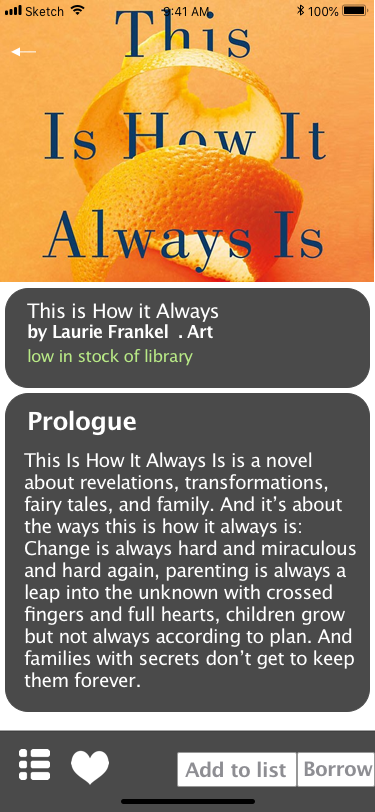
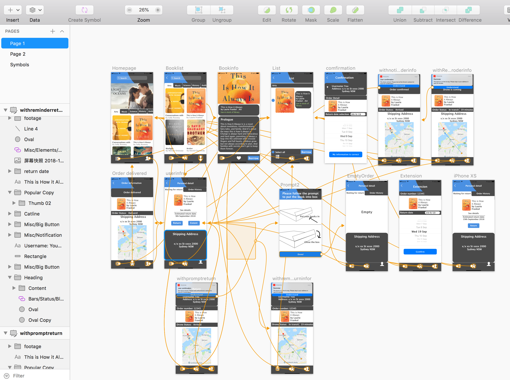

# pigeon.github.io
<!doctype html>
<html lang="en">
  <head>
    <!-- Required meta tags -->
    <meta charset="utf-8">
    <meta name="viewport" content="width=device-width, initial-scale=1, shrink-to-fit=no">

    <!-- Bootstrap CSS -->
    <link rel="stylesheet" href="https://stackpath.bootstrapcdn.com/bootstrap/4.1.3/css/bootstrap.min.css" integrity="sha384-MCw98/SFnGE8fJT3GXwEOngsV7Zt27NXFoaoApmYm81iuXoPkFOJwJ8ERdknLPMO" crossorigin="anonymous">

    <!-- Grab Google Fonts -->
    <link href="https://fonts.googleapis.com/css?family=Lato:300,400|Montserrat" rel="stylesheet">

    <!-- Custom CSS File -->
    <link rel="stylesheet" href="./css/custom.css">

    <!-- Page Title -->
    <title>Hello, world!</title>

    <!-- This is our Meta Description -->
    <meta name="description" content="What you write here will often show up in search results under the page title">

  </head>
  <body>

      <!-- This is where our Navbar lives -->
      <nav class="navbar fixed-top navbar-expand-lg navbar-light">
        
<a class="navbar-brand" href="#">SKR</a>
          <button class="navbar-toggler" type="button" data-toggle="collapse" data-target="#navbarNavAltMarkup" aria-controls="navbarNavAltMarkup" aria-expanded="false" aria-label="Toggle navigation">
            
          </button>

  
      </nav> 
      <!-- Navbar End -->

      

        

          

            
            

              

                <h1>Pigeon</h1>
              

            

            

              

                <h3>Introduction</h3>
              

            

            

              

                
After completing our high fidelity prototype from the second assignment, we keep on iterating the process to refine our application, fix all encountered bugs and integrate some extra functions. This time we only have a limited amount of time of two weeks, hence we come up with two design ideas based on the hi-fi prototype from the previous assignment.

              

            

            

              

                <h3>Design 1 - Pigeon 2.1</h3>
              

            

            

              

                
There are a lot of improvements in this model compared to the final prototype from the last assignment. It has better interface and intuative visual design. Furthermore, users could extend the due books to a specific date.We tested it with 6 potential users. They are formerly participated in our interviews and user feedbacks, thus they knew the progression in our project and have a better view of what we are trying to achieve. Instead of testing with a low-fidelity mock-ups on Marvel as before, this time they have a chance to test a high-fidelity prototype we made on inVision 

              

              

                
                Figure 1.1 - Pigeon 2.1 Interface
              

            

            

              
 

            

			
            

              

                <h4>App Structure Flow Chart</h4>
              

              

                
                Figure 1.2 - Pigeon 2.1 Structure Flow Chart
              

            

			
			

              

                <h4>Walkthrough Video</h4>
              

              

                <iframe width="720" height="562" src="./img/pigeon/pigeon2.1.mp4" frameborder="0" allow="autoplay; encrypted-media" allowfullscreen></iframe>
              

            

            

              

                <h4>inVision Link</h4>
              

            

            

              

                
Availble at : https://projects.invisionapp.com/share/KQM15769064F69

              

            

            

 

            

        
 

            
                     
               

            

              

                <h4>Results</h4>
              

            

            

              

                
Participants were really pleased with the new interface and improvements. They believed the borrow/return steps were smoother and easier to recognize since we integrated an instruction page. The extend function that they complained about had been fixed. However, they also encountered some new problems. Some pages could not go back after you have reached a certain point. There was no way for them to cancel the order half-way if they misclicked and it was really frustrated. Participants could not understand the difference between "add to list" and "borrow" buttons. Meanwhile, there was no notification to confirm if their order was about to arrive.

              

              

                
                Figure 1.1 - Pigeon 2.1 was tested by Anny
              

            

          

              

                <h4>Recommendations</h4>
              

            

            

              

                
During the experience, all participants recommended us to check for the "return" buttons of all pages to make sure it works properly. The problem regarding misclicks needs to be reconsidered and integrated with some kinds of function to prevent it from happening. Users believed "add to list" and "borrow" buttons should be merged into one or replaced with something more helpful. Participants enjoyed the face recognition system, nevertheless, they expected us to add extra methods of recognition in case that system is malfunction or unreliable. With all those improvements, they positively think this app will be "good to go". 

              

            

            
             

              

                <h3>Design 2 - Pigeon 2 Final</h3>
              

            

            
            

              

                
This prototype was an enhanced version of Pigeon 2.1 with a lot of bugs fixed, some small changes that help improve user's experienece. We tested it with 6 potential users. They are formerly participated in our interviews and user feedbacks, thus they knew the progression in our project and have a better view of what we are trying to achieve. They were testing this high-fidelity prototype via inVision. 

              

              

                
                Figure 2.1 - Pigeon 2 Final Interface
              

            

            
            

              

                <h4>App Structure Flow Chart</h4>
              

              

                
                Figure 2.2 - Pigeon 2 Final Structure Flow Chart
              

            

			
			

              

                <h4>Walkthrough Video</h4>
              

              

                <iframe width="720" height="562" src="./img/pigeon/Prototype Walkthrough Video.mp4" frameborder="0" allowfullscreen></iframe>
              

            

            
			

              

                <h4>inVision Link</h4>
              

            

            
			

              

                
Availble at : https://projects.invisionapp.com/share/9HR15758748X2J

              

            

            
            

              

                <h4>Changes</h4>
              

         	

           

              

                

                  <ol class="carousel-indicators">
                    <li data-target="#carouselExampleIndicators1" data-slide-to="0" class="active"></li>
                    <li data-target="#carouselExampleIndicators1" data-slide-to="1"></li>
                    <li data-target="#carouselExampleIndicators1" data-slide-to="2"></li>
                    <li data-target="#carouselExampleIndicators1" data-slide-to="3"></li>
                    <li data-target="#carouselExampleIndicators1" data-slide-to="4"></li>
                    <li data-target="#carouselExampleIndicators1" data-slide-to="5"></li>
                    <li data-target="#carouselExampleIndicators1" data-slide-to="6"></li>
                  </ol>
                  

                    

                      
                    

                    

                      
                    

                    

                      
                    

                    

                      
                    

                    

                      
                    

                    

                      
                    

                    

                      
                    

                  

                  <a class="carousel-control-prev" href="#carouselExampleIndicators1" role="button" data-slide="prev">
                    
                    Previous
                  </a>
                  <a class="carousel-control-next" href="#carouselExampleIndicators1" role="button" data-slide="next">
                    
                    Next
                  </a>
                
                
              

            

            
            

              

                <h4>Result</h4>
              

            

            
			

              

                
Participants loved the new interface. They tested everything all over again and quite happy because those bugs they complained about has been fixed. "Add to list" button was replaced with a "list" and "love" icons, hence users believed this is a smart change that proved useful. Besides face id system, at the moment, we integrated an extra manual recognition to cope with the problem they encountered before. All pages in the app was checked carefully to make sure every buttons are going according to plan. Some minor changes were adjusted, such as the change of appearance of "back" icon, the location of notifications, really improved the coherent of the application interface. Participants admitted that this one is a most completed functioning app we have got so far.

              

              

                
                Figure 2.3 - Pigeon 2 Final was tested by Rita
              

            

			
			

              

                <h4>Recommendations</h4>
              

            

            
			

              

                
At this point, participants believed this app only needed to be refined a little bit more until it is published. All we need to do was fixing some typo and misplaced icons. Users also expected us gave them more freedom of choice and some extra functions in the near future.

              

            

            
    <!-- Footer -->
    

      

        

          

            
&copy; 2018 SKR

          

        
  
      

    

    <!-- Optional JavaScript -->
    <!-- jQuery first, then Popper.js, then Bootstrap JS -->
    
    
    

  </body>
</html>
